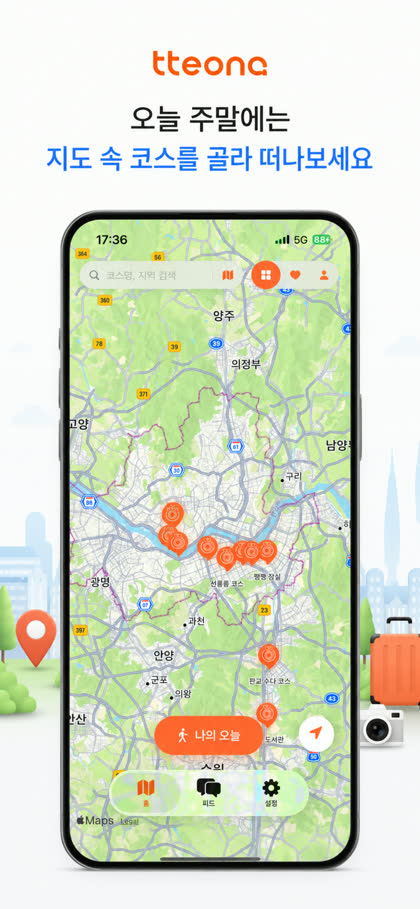
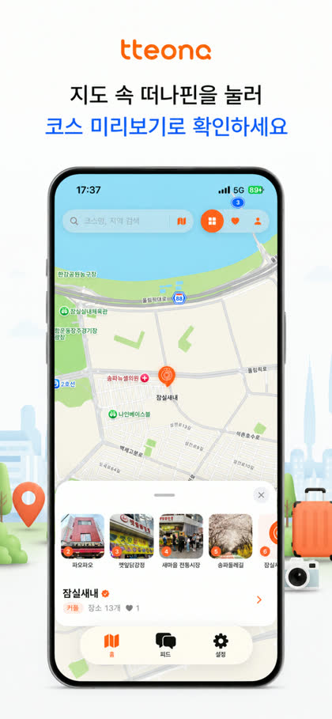
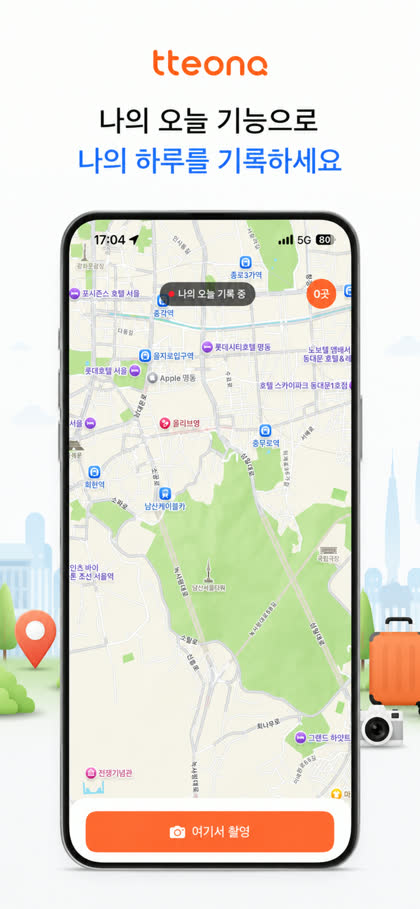
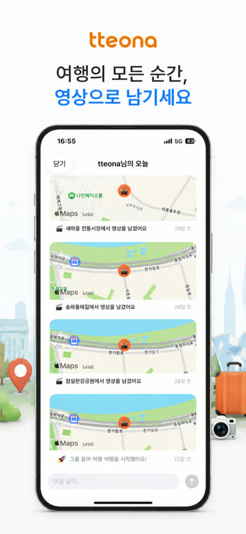
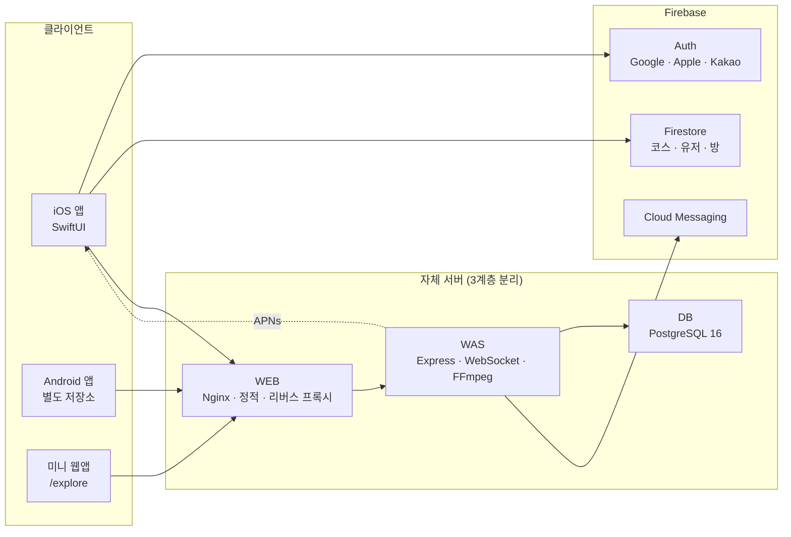

# 떠나 (tteona)

> 여행을 따라 걷기만 하면, 하루가 끝날 때 브이로그가 만들어져 있습니다.

GPS로 장소 도착을 감지해 촬영을 알리고, 모아둔 클립을 자동으로 이어 붙여 브이로그를 완성하는 앱입니다.
**App Store와 Google Play에 출시해 운영 중이며**, 기획부터 iOS · Android 앱, 서버, 인프라, 운영까지 1인이 개발했습니다.

<a href="https://apps.apple.com/kr/app/id6767218543"></a>
<a href="https://play.google.com/store/apps/details?id=com.seoktaedev.tteona"></a>
<a href="https://tteona.kr/explore"></a>


<table>
<tr>
<td width="25%"></td>
<td width="25%"></td>
<td width="25%"></td>
<td width="25%"></td>
</tr>
<tr>
<td align="center"><sub>코스 탐색</sub></td>
<td align="center"><sub>코스 미리보기</sub></td>
<td align="center"><sub>도착 → 촬영</sub></td>
<td align="center"><sub>브이로그 완성</sub></td>
</tr>
</table>

---

## 한눈에 보기

| | |
|---|---|
| **출시** | **App Store** 2026.06.08 · **Google Play** — 양대 마켓 출시 후 지속 업데이트 중 |
| **개발 기간** | 2026.05 ~ 운영 중 (출시까지 약 1개월, 이후 계속 개선) |
| **개발 인원** | 1인 — 기획 · iOS · Android · 서버 · 인프라 · 운영 |
| **규모** | iOS Swift 27,011줄 (107개 파일) · 서버 4,234줄 · 커밋 167회 |
| **지원 언어** | 한국어 · English · 日本語 (문자열 790개) |
| **인프라** | 2026년 위치정보 클라우드 지원사업 선정 — WEB / WAS / DB 3계층 |

---

## 왜 만들었나

여행 영상을 찍어도 편집이 귀찮아 갤러리에 묻힙니다. 주변에 물어보니 다들 같았습니다.
**찍는 부담과 편집하는 부담을 동시에 없애지 않으면 기록은 남지 않는다**고 보고, 두 가지를 정했습니다.

| | 기존 여행 기록 앱 | 떠나 |
|---|---|---|
| 촬영 | 사용자가 알아서 | **장소에 도착하면 앱이 먼저 부른다** |
| 길이 | 제한 없음 | **짧게 강제** — 고민할 시간을 없앤다 |
| 편집 | 사용자가 직접 | **자동 합성** — 지도·자막·BGM까지 |

기존 앱들이 *찍은 다음 정리하는* 도구라면, 떠나는 **장소가 사용자를 불러내는** 방식입니다.
위치를 쓰는 것이 이 앱의 차별점이자 존재 이유입니다.

---

## 핵심 흐름

```
코스 선택 ──▶ 이동 ──▶ 도착 감지 ──▶ 촬영 알림 ──▶ 짧은 촬영 ──▶ 자동 합성 ──▶ 브이로그
   지도        백그라운드 위치추적      푸시/로컬알림      클립 저장      지도·자막·BGM
```

---

## 기능

### 코스
- 지도 위에서 다른 사용자가 만든 여행 코스 탐색 · 좋아요 · 저장
- 직접 코스를 만들어 공유, 장소별 이동 시간·거리 안내 (자동차 / 대중교통 / 도보)
- 관광공사 TourAPI 기반 큐레이션 코스, 장소 사진은 좌표 검증 후 Google Places로 폴백
- 코스 상세에서 네이버지도 · 카카오맵 · 애플지도로 바로 길찾기 연결

### 촬영과 브이로그
- 백그라운드 위치 추적으로 도착 감지 → 알림 탭 한 번에 카메라 실행
- 손떨림 보정, 핀치 줌, 탭 초점, 촬영 예산(남은 클립 수) 표시
- 클립 · 지도 핀 · 장소 자막을 하나의 영상으로 합성
- 릴스(세로) / 유튜브(가로) / 인스타(정방형) 포맷별 독립 합성
- 자막 폰트 · 크기 · 색상 · 표시 항목 커스터마이즈, BGM 선택
- 완성한 브이로그를 함께 간 사람들의 방 채팅으로 자동 공유

### 함께 가기
- 세션 방 생성 → 초대 → 실시간 채팅 (읽음 수 · 시간 그룹핑 · 이모지 반응)
- 실시간 위치 공유로 일행 위치 확인
- 발자취(Footprint) 기록과 지역별 방문 통계

### 그 외
- 한국어 · 영어 · 일본어 (문자열 790개), 푸시 알림도 수신자 언어로 발송
- PRO 구독 (RevenueCat) — 포맷 · BGM · 클립 수 게이팅
- 홈 위젯 + Live Activity로 진행 중인 세션 표시
- 첫 브이로그까지 안내하는 실행형 튜토리얼
- 신고 · 차단 · 콘텐츠 모더레이션, 게스트 모드

---

## 아키텍처



### 왜 Firebase와 자체 서버를 같이 쓰나

처음엔 Firestore만으로 시작했지만, 기능이 늘면서 **Firestore로는 감당이 안 되는 작업**이 생겼습니다.
그래서 둘을 역할로 나눴습니다.

| | Firebase | 자체 서버 (Node.js + PostgreSQL) |
|---|---|---|
| 맡는 일 | 인증, 코스·유저·방 문서, 푸시 발송 | 영상 합성, 실시간 통신, 캐시, 집계, 관리자 |
| 이유 | 인증·실시간 동기화를 직접 만들 이유가 없다 | 무거운 연산과 관계형 질의는 서버가 유리하다 |
| 예 | 로그인, 코스 목록 | FFmpeg 합성, WebSocket 채팅, 방문 통계 |

**서버로 넘긴 것들의 구체적인 이유**

- **영상 합성** — 기기에서 하면 배터리와 발열을 감당하기 어렵고, 앱을 닫으면 중단됩니다. 작업을 `vlog_jobs` 테이블에 큐로 쌓고 서버에서 처리합니다.
- **실시간 채팅 · 위치 공유** — 문서 구독보다 WebSocket이 지연과 비용 양쪽에서 낫습니다. 읽음 수 계산처럼 조인이 필요한 질의도 관계형이 자연스럽습니다.
- **외부 API 캐시** — 장소 사진 · 번역 · 추천 결과를 캐시 테이블에 저장해 API 호출량과 응답 시간을 줄였습니다.
- **집계와 관리자** — 코스 퍼널, 방문 통계, 지역별 분포처럼 집계 질의가 필요한 것들.

### 서버 API

| 그룹 | 하는 일 |
|---|---|
| `/api/vlog` | 브이로그 합성 작업 등록 · 상태 조회 · 공유 토큰 발급 |
| `/api/courses` | 코스 조회 · 썸네일 · 퍼널 이벤트 수집 |
| `/api/rooms` | 세션 방, 메시지, 읽음 처리, 방 이미지 |
| `/api/push` | 디바이스 토큰 등록, APNs / FCM 2경로 발송 |
| `/api/places` | 장소 상세 · 사진 · 리뷰 (좌표 검증 + 캐시) |
| `/api/route` | 자동차 · 대중교통 · 도보 경로 |
| `/api/translate` | 번역 (캐시 테이블 경유) |
| `/api/stats`, `/api/users` | 방문 통계, 프로필 |
| `/api/public/explore` | 인증 없이 열리는 공개 탐색 API (웹앱용) |
| `/api/admin` | 관리자 대시보드 분석 API |

> 푸시는 **APNs와 FCM 두 경로**를 씁니다. iOS는 APNs 직결이 빠르고, 안드로이드와 웹은 FCM이 필요합니다. APNs는 production 실패 시 sandbox로 폴백합니다.

---

## 기술 스택

| 영역 | 사용 |
|---|---|
| **iOS** | Swift 5.9, SwiftUI, MVVM, Combine |
| **지도 · 위치** | MapKit, Google Maps SDK, CoreLocation (백그라운드 추적) |
| **카메라 · 영상** | AVFoundation, AVMutableComposition, AVVideoComposition |
| **시스템 연동** | WidgetKit, ActivityKit(Live Activity), PhotoKit, UserNotifications |
| **인증** | Firebase Auth + Sign in with Apple / Google / Kakao |
| **결제** | RevenueCat |
| **서버** | Node.js, Express, WebSocket(ws), FFmpeg, sharp, node-cron |
| **DB** | PostgreSQL 16, Firestore |
| **인프라** | Nginx, PM2, Let's Encrypt, WEB/WAS/DB 3계층 분리 |
| **푸시** | APNs(@parse/node-apn), Firebase Cloud Messaging |

---

## 프로젝트 구조

```
tteona/
├── tteona/                     # iOS 앱
│   ├── Core/
│   │   ├── Models/             # Course, Room, Footprint, AppUser …
│   │   ├── Services/           # 39개 서비스 계층
│   │   │   ├── VlogService, VlogServerService      # 브이로그 합성
│   │   │   ├── LocationService, LocationSocketService
│   │   │   ├── ChatSocketService, RoomService
│   │   │   ├── CourseService, PlaceSearchService, PlacesPhotoService
│   │   │   ├── ProManager, PushService, FCMService
│   │   │   └── …
│   │   ├── LiveActivity/
│   │   └── Utils/
│   ├── Features/               # 화면 단위 모듈
│   │   ├── Auth/  Main/  Explore/  Discover/
│   │   ├── CourseDetail/  ActiveSession/  Capture/  Camera/
│   │   ├── Vlog/  Group/  Profile/  Settings/  Pro/  Tutorial/
│   ├── Fonts/                  # Pretendard 외 한글 폰트 10종
│   └── Localizable.xcstrings   # ko / en / ja
├── tteona_WidgetExtension/     # 홈 위젯 + Live Activity
├── server.js                   # Express 서버 (API · WebSocket · 합성 큐)
├── functions/                  # Firebase Functions (FCM)
├── admin/                      # 관리자 대시보드 (분석 7탭)
├── web/                        # 미니 웹앱 · 약관 페이지
├── docs/                       # 아키텍처 · 보안 감사 · 수익화 등 문서
└── scripts/                    # 운영 스크립트
```

---

## 코드를 처음 보신다면

파일이 많으니 이 순서로 보시면 흐름이 잡힙니다.

| 보는 순서 | 파일 | 여기서 알 수 있는 것 |
|---|---|---|
| 1 | [`tteona/Core/Services/LocationService.swift`](tteona/Core/Services/LocationService.swift) | 백그라운드 위치 추적과 도착 감지 — 이 앱의 출발점 |
| 2 | [`tteona/Core/Services/VlogService.swift`](tteona/Core/Services/VlogService.swift) | 클립·지도·자막을 하나로 합치는 영상 합성 파이프라인 |
| 3 | [`tteona/Core/Services/VlogServerService.swift`](tteona/Core/Services/VlogServerService.swift) | 무거운 합성을 서버로 넘기고 상태를 폴링하는 부분 |
| 4 | [`server.js`](server.js) | API · WebSocket · 합성 큐가 한 파일에 모여 있습니다 |
| 5 | [`tteona/Core/Services/ChatSocketService.swift`](tteona/Core/Services/ChatSocketService.swift) | 실시간 채팅 클라이언트 (재연결 · 토큰 인증) |

> `server.js`가 4,000줄이 넘습니다. 기능을 빠르게 붙이느라 한 파일에 쌓인 것이고,
> 라우터 단위로 분리하는 것이 지금 가장 시급한 리팩터링 과제입니다.

---

## 기술적으로 씨름한 것

### 1. 세로·가로 클립이 섞이면 영상이 돌아가던 문제

여러 클립을 하나로 합칠 때, 세로로 찍은 것과 가로로 찍은 것이 섞이면 완성본에서 화면이 회전돼 버렸습니다.
영상 파일마다 붙어 있는 **회전 정보(preferredTransform)를 개별로 읽어 좌표를 보정**하는 방식으로 해결했고,
포맷(릴스 / 유튜브 / 인스타)별로 합성 경로를 독립시켜 서로 간섭하지 않게 했습니다.

### 2. 배터리와 도착 정확도의 균형

도착을 빨리 감지하려면 위치를 자주 확인해야 하지만, 여행 내내 켜두는 앱이라 배터리가 문제였습니다.
갱신 주기와 도착 판정 반경을 바꿔가며 **실제로 여행하면서 반복 테스트**해 기준을 정했습니다.
시뮬레이터로는 답이 나오지 않는 문제였습니다.

### 3. 배포 한 번에 끊긴 실시간 기능

서버 재배포 후 채팅과 위치 공유가 동작하지 않았습니다. 앱 코드는 건드리지 않았는데 증상은 앱에서만 보였습니다.
원인은 배포 스크립트가 저장소의 설정 파일로 **Nginx 설정을 통째로 덮어쓰면서 WebSocket 업그레이드 블록이 사라진 것**이었습니다.
설정을 복구하고, 재배포 후 WebSocket 핸드셰이크(HTTP 101)를 확인하는 절차를 추가했습니다.
장애가 났을 때 가장 먼저 볼 것은 코드가 아니라 **최근에 바뀐 것**이라는 원칙을 여기서 얻었습니다.

---

## 로컬에서 실행하기

### 요구사항
- Xcode 16 이상 / iOS 17.0 이상
- Node.js 20 이상, PostgreSQL 16 (서버를 함께 돌릴 경우)

### iOS 앱

```bash
git clone https://github.com/seoktae-lee/tteona.git
cd tteona
open tteona.xcodeproj
```

1. Firebase Console에서 프로젝트를 만들고 `GoogleService-Info.plist`를 프로젝트에 추가
2. Authentication에서 Google / Apple 로그인 활성화
3. `Cmd + R`로 실행

> 위치 · 카메라 기능은 **실기기**에서 확인하세요. 시뮬레이터로는 도착 감지와 촬영을 검증할 수 없습니다.

### 서버

```bash
npm install
cp .env.example .env      # DB 접속 정보, API 키 입력
node server.js
```

`GET /health`로 기동을 확인할 수 있습니다.

> API 키와 인증서는 저장소에 포함하지 않습니다.

---

## 문서

프로젝트를 진행하며 정리한 문서들입니다.

| 문서 | 내용 |
|---|---|
| [`docs/ARCHITECTURE.html`](docs/ARCHITECTURE.html) | 전체 구조와 유지보수 가이드 |
| [`docs/SECURITY_LEGAL_AUDIT.md`](docs/SECURITY_LEGAL_AUDIT.md) | 보안 · 법적 요건 점검 |
| [`docs/LBS_FILING.md`](docs/LBS_FILING.md) | 위치기반서비스 사업자 신고 |
| [`docs/MONETIZATION.md`](docs/MONETIZATION.md) | 구독 설계 |
| [`docs/TROUBLESHOOTING.md`](docs/TROUBLESHOOTING.md) | 장애 대응 기록 |
| [`CLOUD_INFRA.md`](CLOUD_INFRA.md) | 서버 구성과 배포 |

---

## 개인정보 처리

- **영상은 보관 기간이 지나면 자동 삭제됩니다.** 합성 완료 7일 / 실패 3일 / 업로드 미시작 24시간이 지난 작업 폴더를 6시간마다 도는 정리 작업이 지웁니다. 디스크 여유가 5GB 아래로 떨어지면 경고를 남깁니다.
- 위치 데이터는 **도착 감지와 사용자가 켠 위치 공유에만** 사용합니다.
- 위치정보 이용에 대한 접근 기록을 별도 테이블에 남깁니다 (위치정보법 대응).
- 관련 문서: [이용약관](https://tteona.kr/terms.html) · [개인정보처리방침](https://tteona.kr/privacy.html)

---

## 관련 저장소

| 저장소 | 내용 |
|---|---|
| [tteona](https://github.com/seoktae-lee/tteona) | iOS 앱 + 서버 + 웹 (현재 저장소) — [App Store 출시](https://apps.apple.com/kr/app/id6767218543) |
| [tteona-android](https://github.com/seoktae-lee/tteona-android) | Android 앱 (Kotlin, Jetpack Compose) — [Google Play 출시](https://play.google.com/store/apps/details?id=com.seoktaedev.tteona) |

두 앱은 같은 서버와 데이터를 공유하며, 기능 패리티를 맞춰 함께 업데이트합니다.

---

## 라이선스

개인 프로젝트입니다. 코드 열람은 자유이나, 복제 · 재배포 · 상업적 이용은 허용하지 않습니다.

---

## 개발자

**이석태** · 한국외국어대학교 정보통신공학과

- GitHub [@seoktae-lee](https://github.com/seoktae-lee)
- 관심 분야: 백엔드 — 서버 아키텍처, 실시간 통신, 서비스 운영

1인 개발 프로젝트입니다. 피드백이나 제안은 Issues로 남겨주세요.
